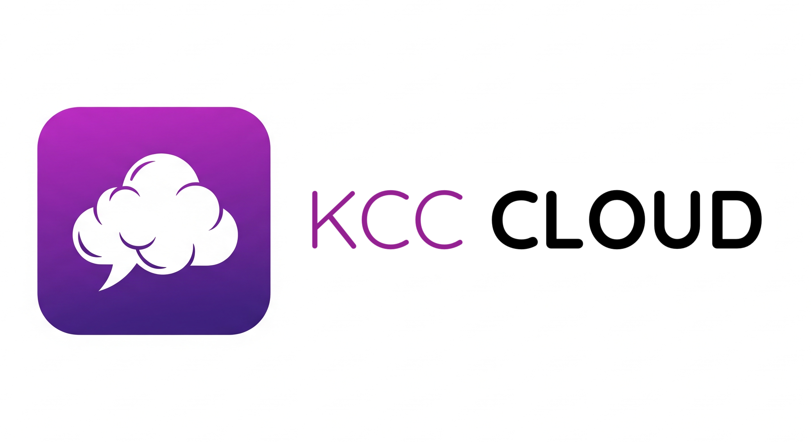
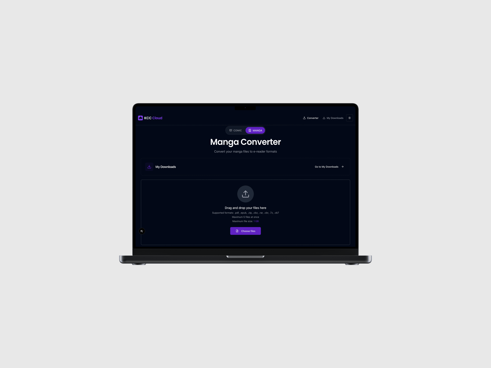
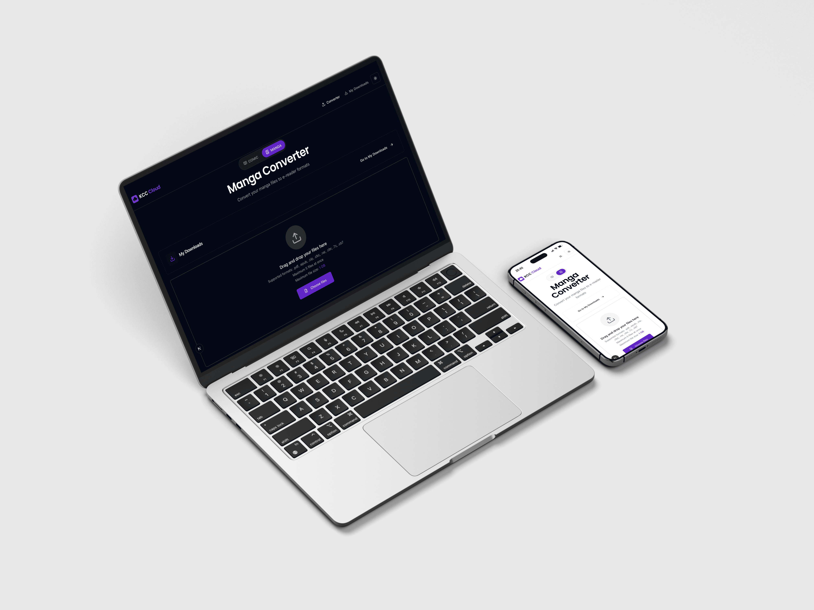
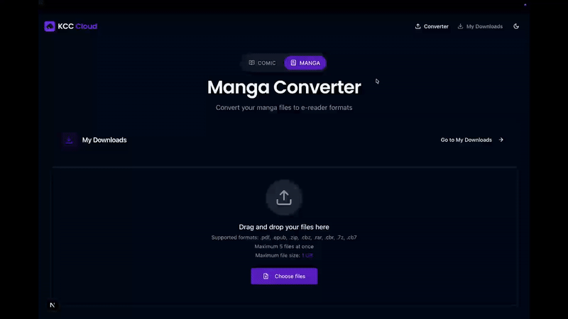
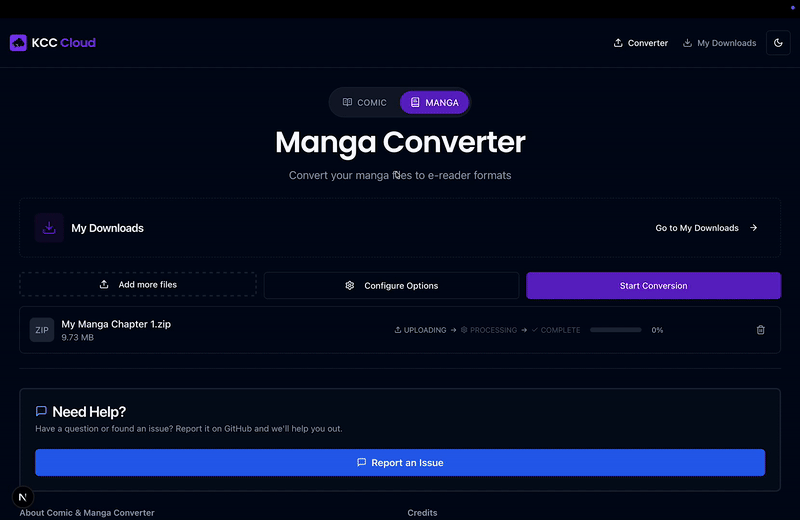
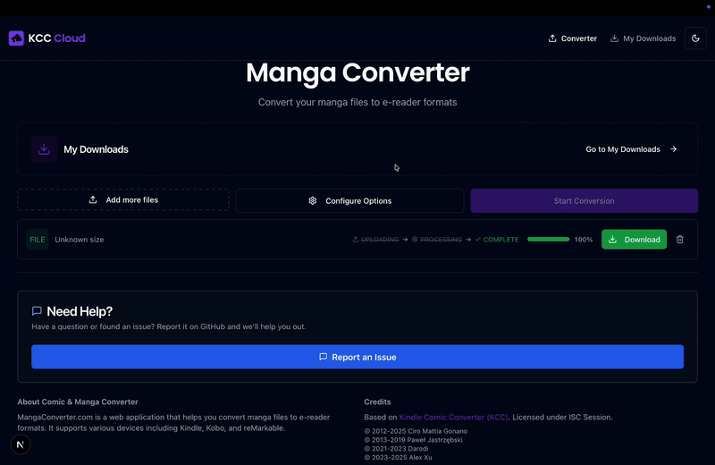
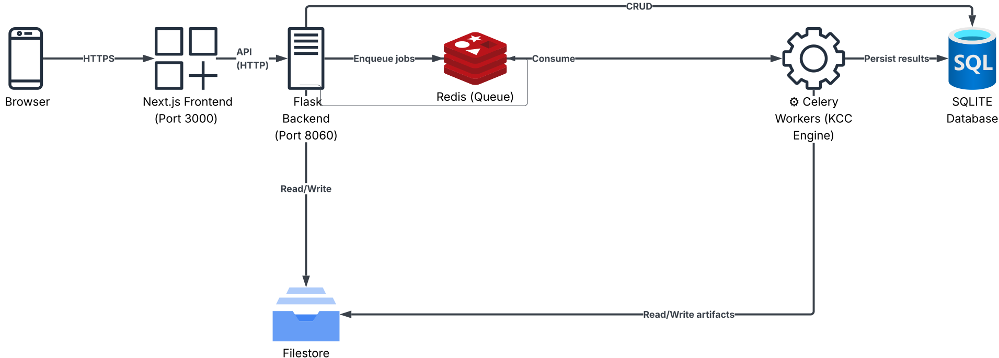

 

<!-- PROJECT LOGO -->
<div align="center">


<br/><br/>

**A self-hosted web application for converting manga and comics to e-reader optimized formats**

<br/>

[](https://www.mangaconverter.com)
[](LICENSE)
[](https://github.com/nilsleo/kcc-cloud/stargazers)
[](https://github.com/nilsleo/kcc-cloud/network/members)
[](https://github.com/nilsleo/kcc-cloud/releases)
 

 

[🌐 Live Demo](https://www.mangaconverter.com) • [Quick Start](#-quick-start) • [Architecture](#-architecture) • [Contributing](#-contributing)

</div>


<!-- TABLE OF CONTENTS -->
  <summary>📑 Table of Contents</summary>
  <ol>
    <li><a href="#-overview">Overview</a></li>
    <li><a href="#-usage">Usage</a></li>
    <li><a href="#-architecture">Architecture</a></li>
    <li><a href="#-quick-start">Quick Start</a></li>
    <li><a href="#-configuration">Configuration</a></li>
    <li><a href="#-contributing">Contributing</a></li>
    <li><a href="#-license">License</a></li>
    <li><a href="#-acknowledgments">Acknowledgments</a></li>
    <!-- <li><a href="#-star-history">Star History</a></li> -->
  </ol>


## 📖 Overview

KCC Cloud transforms your manga, comics, and documents into e-reader optimized formats (EPUB, MOBI, PDF, KFX, CBZ) with a modern, responsive web interface. Built for self-hosting with Docker, it provides multi-device access, real-time job monitoring, and parallel processing capabilities.

> **🚀 Try it now:** [www.mangaconverter.com](https://www.mangaconverter.com) — No installation required!

> **💡 Tip:** Works great on mobile too! Try uploading a file from your smartphone to see the responsive design in action.

<p align="center">
  
  
</p>

### Built on KCC

This project is powered by **[Kindle Comic Converter (KCC)](https://github.com/ciromattia/kcc)**, an excellent open-source tool by Ciro Mattia Gonano and Paweł Jastrzębski. We're deeply grateful for their work, which forms the conversion engine of this application.

### Why Choose the Web Interface?

While KCC's desktop GUI is fantastic, this web-based alternative offers compelling advantages for modern workflows:

| Benefit | Description |
|------|-------------|
| **Multi-Device Access** | Access the converter from any device—desktop, tablet, or smartphone—via your browser |
| **Simultaneous Processing** | Celery worker pool enables parallel conversion of multiple files, significantly faster than sequential GUI processing |
| **One-Time Setup** | Deploy once with Docker Compose, then access from anywhere on your network—no repeated installations |
| **Centralized Storage** | All conversions stored on the server, accessible from any device without file transfers |
| **Always Available** | Runs 24/7 as a service, queue jobs anytime without launching a desktop application |
| **Responsive Design** | Optimized UI for mobile, tablet, and desktop—convert manga on your phone while commuting |
| **Real-Time Monitoring** | Live progress updates via WebSocket, monitor conversions from multiple devices simultaneously |
| **Job History** | Persistent database tracks all conversions, redownload files anytime |


## 📱 Usage

### Basic Conversion

1. **Upload Files**: Drag-and-drop or click to browse
2. **Select Device**: Choose from 35+ e-reader profiles (e.g., Kindle Paperwhite, Kobo Clara)
3. **Configure Options** (optional): Expand "Advanced Options" for fine-tuning
4. **Convert**: Click "Convert" button
5. **Monitor**: Watch real-time progress with ETA
6. **Download**: Click download button when complete



### Advanced Options

Fine-tune your conversions with 25+ parameters including image processing, cropping, borders, manga-specific settings, and output quality controls.



<details>
<summary>View all 25+ conversion parameters</summary>

**Image Processing**
- Upscale images for higher quality
- Stretch to fill screen (no borders)
- High quality mode (slower, better output)
- Auto-level for contrast adjustment
- Force grayscale or color

**Cropping & Margins**
- Margin detection (4 levels: none to aggressive)
- Page number removal
- Preserve original margins
- Cropping power adjustment

**Borders**
- Black/white border detection
- Force black or white borders
- Border size control

**Output Quality**
- Gamma correction (0.1-2.0)
- Target file size limits
- mozJPEG compression
- Force PNG format

**Manga-Specific**
- Right-to-left reading mode
- Two-panel detection
- Webtoon mode (vertical scroll)
- Spread shift for two-page layouts

**Orientation**
- Rotation (0°, 90°, 180°, 270°)
- Auto-rotation
- Landscape split mode

</details>

### Downloads Page

Access all your completed conversions with download links, file details, and the ability to delete conversions you no longer need.


 


## 🏗️ Architecture



**Microservices Architecture:**
- **Frontend**: Next.js 16 with React 19, TypeScript, Tailwind CSS, Radix UI
- **Backend API**: Flask 2.0 with Gunicorn, Socket.IO for WebSocket real-time updates
- **Task Queue**: Celery 5.3 with Redis broker for distributed job processing
- **Database**: SQLite for job metadata and history
- **Storage**: Local filesystem for uploads and converted files
- **Deployment**: Docker Compose orchestration with scalable worker pool

<!-- Tech stack badges kept here (architecture section) -->
<p align="center">
  
  
  
  
  
  
  
  
  
  
</p>


 


## 🚀 Quick Start

### Prerequisites

- Docker & Docker Compose installed
- 2GB+ RAM available
- 10GB+ disk space for conversions

### Installation (Docker Compose)

1. Create a new folder for your deployment (anywhere on your machine):
   ```bash
   mkdir mangaconverter && cd mangaconverter
   ```

2. Create a `docker-compose.yml` with the following content:
   ```yaml
   services:
     app:
       image: nilsleo/kcc-cloud:latest
       container_name: kcc-cloud
       restart: unless-stopped
       ports:
         - "8080:80"
       environment:
         - USER_ID=1000           # set to your user id (run: id -u)
         - GROUP_ID=1000          # set to your group id (run: id -g)
         - TZ=Europe/Berlin       # set your timezone
         - NEXT_PUBLIC_MAX_FILES=10
         - CELERY_WORKERS=2       # parallel conversions; increase for more throughput
       volumes:
         - ./volumes/data:/data
         # Optional: mount KindleGen if you have it (read-only)
         # Download from https://archive.org/details/kindlegen and place in ./volumes/kindlegen
         - ./volumes/kindlegen:/opt/backend/kindlegen:ro
   ```

3. Start the app:
   ```bash
   docker compose up -d
   ```

4. Access the web interface:
   - App: http://localhost:8080

### Adding KindleGen (Required for Kindle Conversions)

1. **Download KindleGen**: Amazon's conversion tool for MOBI/AZW3 formats. Get the Linux version from [archive.org/details/kindlegen](https://archive.org/details/kindlegen)

2. **Place the binary**: Extract and place the `kindlegen` binary in `./volumes/kindlegen/` folder (create if needed)

3. **Restart**: The volume mount in docker-compose.yml will make it available. Run `docker compose restart` if already running

### Scaling Workers

Increase `CELERY_WORKERS` in your `docker-compose.yml` and redeploy:

```yaml
environment:
  - CELERY_WORKERS=5   # e.g., 5 parallel workers
```

Then apply the change:

```bash
docker compose up -d
```


## ⚙️ Configuration

### Environment Variables

Key configuration options in `.env`:

| Variable | Default | Description |
|-------|---------|-------------|
| `CELERY_CONCURRENCY` | 2 | Jobs per worker container |
| `NEXT_PUBLIC_MAX_FILES` | 10 | Max simultaneous uploads |
| `NEXT_PUBLIC_MAX_FILE_SIZE` | 1GB | Max single file size |
| `ALLOWED_ORIGINS` | localhost:3000 | CORS allowed origins |


### Performance Tuning

**For high-volume conversions:**
```bash
# .env adjustments
CELERY_CONCURRENCY=4          # More jobs per worker
GUNICORN_TIMEOUT=1200         # Longer timeout for large files

# Scale workers
docker compose up -d --scale celery-worker=10
```

**For low-resource systems:**
```bash
# .env adjustments
CELERY_CONCURRENCY=1          # Single job per worker
```


## 🤝 Contributing

We welcome contributions! Please see [CONTRIBUTING.md](CONTRIBUTING.md) for guidelines.


## 📄 License

This project is licensed under the **ISC License** - see the [LICENSE](LICENSE) file for details.
 

## 🙏 Acknowledgments

Special thanks to:
- **[Ciro Mattia Gonano](https://github.com/ciromattia)** and **[Paweł Jastrzębski](https://github.com/darodi)** for creating Kindle Comic Converter
- The open-source community for all the amazing libraries and tools


<!-- STAR HISTORY - Uncomment when you have some stars! -->
<!--
## ⭐ Star History

[](https://star-history.com/#nilsleo/kcc-cloud&Date)


-->

<div align="center">

### ⭐ Found this useful?

**[Star this repo](https://github.com/nilsleo/kcc-cloud/stargazers)** to help others discover it!

[](https://github.com/nilsleo/kcc-cloud/stargazers)
[](https://github.com/nilsleo/kcc-cloud/fork)

<br/>

Made with ❤️ for the manga and comic community

<br/>

**[🌐 Try Live Demo](https://www.mangaconverter.com)** •
**[Report Bug](https://github.com/nilsleo/kcc-cloud/issues)** •
**[Request Feature](https://github.com/nilsleo/kcc-cloud/issues)**

<br/>
</div>
